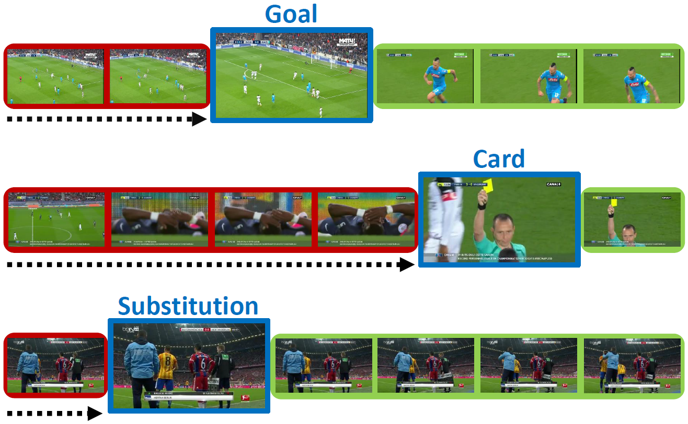

# RMS-Net: Regression and Masking for Soccer Event Spotting
This repository contains the train and test code for the paper _[RMS-Net: Regression and Masking for Soccer Event Spotting](https://arxiv.org/abs/2102.07624)_.

This is an extended codebase for soccer event spotting on _[SoccerNet_v2](https://arxiv.org/pdf/2011.13367.pdf)_, which contains 17 classes (the original masking strategy presented in the RMS-Net paper has not been tested yet on the extended set of classes).

<p align="center">

</p>

## Requirements
The required Python packages are:
* torch>=1.6.0
* _[SoccerNetv2-DevKit](https://github.com/SilvioGiancola/SoccerNetv2-DevKit/tree/main/Evaluation)_
* numpy>=1.17.2
* PIL>=8.0.1

## Frames and annotations
**Frames**

For our experiments, we extracted frames at 2 fps from the original 25fps full soccer videos. Frames should be organized as follows (each half-match in a separate directory):

      frames_dir
          |
          |-> england_epl_2014-2015_2015-02-21 - 18-00 Chelsea 1 - 1 Burnley_1
          |       |-> 0001.jpg
          |       |-> 0002.jpg
          |       |
          |
          |-> england_epl_2014-2015_2015-02-21 - 18-00 Chelsea 1 - 1 Burnley_2
          |       |-> 0001.jpg
          |       |-> 0002.jpg
          |       |

**Annotations**
Please follow the instructions _[here](https://github.com/SilvioGiancola/SoccerNetv2-DevKit/tree/main/Download)_ to download action spotting annotations.
We will refer to the directory containing annotations as "annotation_dir".

**Listgame Splits**
Please download "listgame_Test_100.npy", "listgame_Valid_100.npy", and "listgame_Train_300.npy" from _[here](https://github.com/SilvioGiancola/SoccerNet-code/tree/master/data)_ and put them under the "listgame_dir" directory.

## Training and Testing
**Training**

Run `python train.py` using the following arguments:

| Argument | Value |
|------|------|
| `--workers ` | Number of workers for data loading |
| `--batch-size ` | Number of clips per batch |
| `--lr ` | The base learning rate |
| `--out_dir ` | Path to the output dir (where checkpoints and output json files will be stored) |
| `--frames_path ` | Path to "frames_dir" |
| `--labels_path ` | Path to "annotation_dir" |
| `--listgame_path ` | Path to "listgame_dir" |

For example, for training on 4 16GB V100 GPUs, use:
```
python train.py --workers 8 -batch-size 24 --lr 0.002 --out_dir "." --frames_path "./frames_dir" --labels_path "./labels_path" --listgame_path "./listgame_path"
```

**Testing**

Add the following arguments to `python train.py` for testing a pre-trained model:

| Argument | Value |
|------|------|
| `--evaluate ` | Specify --evaluate to skip the training loop |
| `--resume ` | Path to the model's weights |
